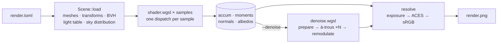
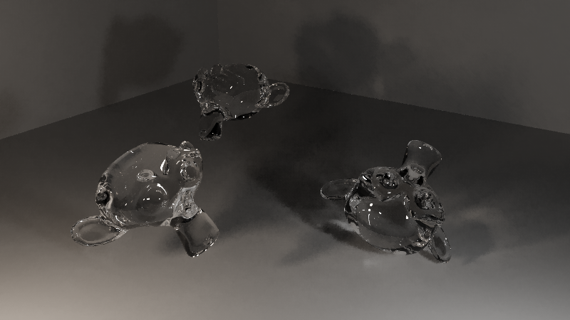
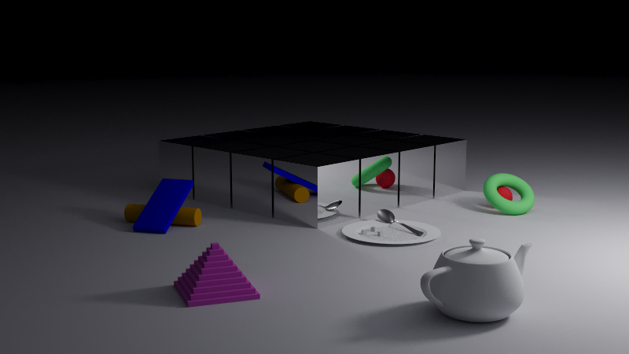
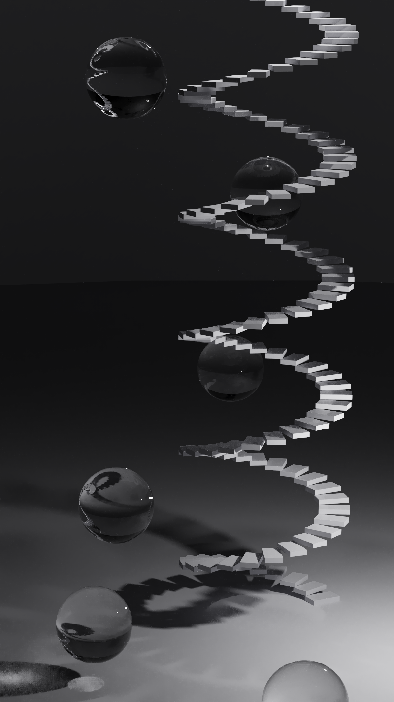
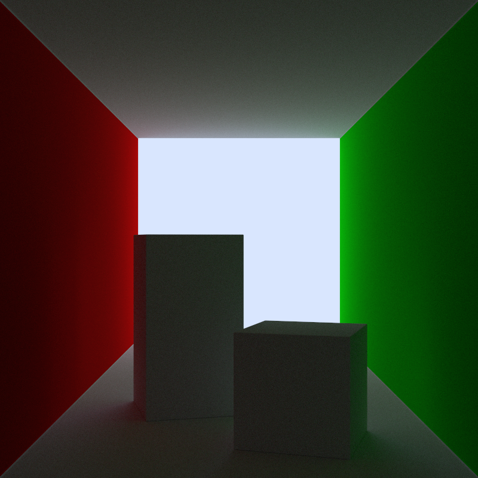
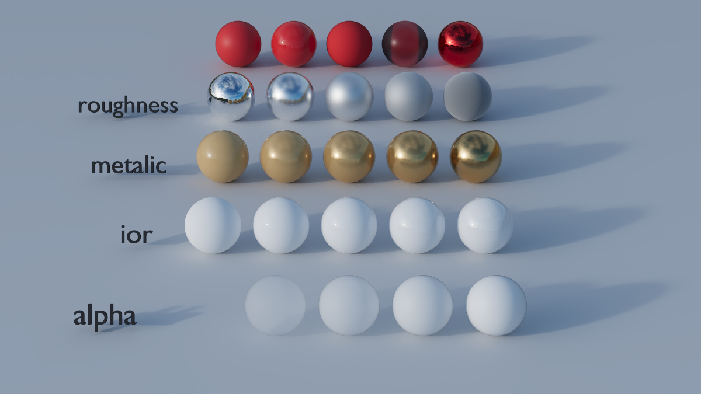
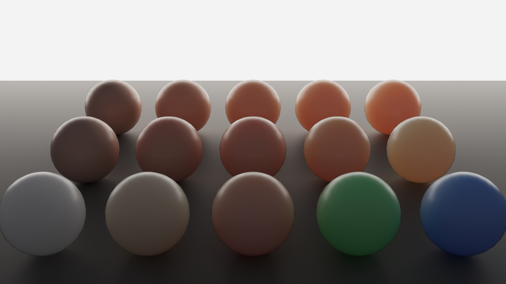
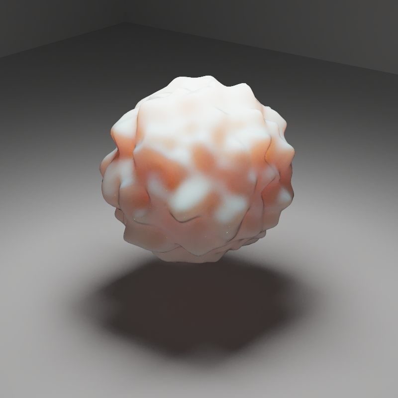

# wgsl-raytrace

A GPU path tracer in Rust. It runs headless on [wgpu](https://wgpu.rs/), and the
tracing kernel is written in [WGSL](https://www.w3.org/TR/WGSL/). It is the GPU
counterpart to [raytrace](https://github.com/theMagicalKarp/raytrace) and reads
the same TOML scene format.


## Quick start

You need [mise](https://mise.jdx.dev/) and a GPU with a working
[WebGPU](https://www.w3.org/TR/webgpu/) backend (Metal, Vulkan, DX12 or GL).

```Bash
mise install                 # install the pinned Rust toolchain
mise run release             # build target/release/wgsl-raytrace
target/release/wgsl-raytrace --config examples/teapot/render.toml --denoise --preview
```

## Command line

```
wgsl-raytrace [OPTIONS] --config <CONFIG>
```

| Flag | Description |
| --- | --- |
| `-c, --config <FILE>` | Scene TOML. Required. |
| `-o, --output <FILE>` | Where to write the PNG. Default `render.png`. |
| `-s, --samples <N>` | Override `camera.samples`. |
| `-p, --preview` | Draw the frame in the terminal as it converges (Kitty graphics protocol). Ctrl-C stops early and keeps what has been traced. |
| `--denoise` | Run the [à-trous filter](#denoising) over the finished frame. `--output` gets the filtered frame. |
| `--debug <DIR>` | Write `raw.png` (the unfiltered frame) and the `normal.png`, `albedo.png` and `depth.png` feature buffers to an existing directory. |
| `--variance <FILE>` | Write a heatmap of per-pixel variance, normalised to the frame's peak. |
| `--outlier-k <K>` | Override `outliers.k`. `0` is off. |
| `--seed <N>` | Draw an independent sample sequence, e.g. for a bias reference that shares no noise with the render. Default `0`. |

### Console output

| Line | Meaning |
| --- | --- |
| `scene:` | Triangle, material and BVH node counts, and tree depth. |
| `render:` | Wall time, covering the mesh load, BVH build, uploads and host stalls. |
| `denoise:` | Filter settings and wall time. Only shown with `--denoise`. |
| `noise:` | Mean per-pixel standard error, mean linear luminance, and peak variance. Use the standard error to compare runs of the same scene at the same sample count. |
| `gpu:` | Per-dispatch GPU time from timestamp queries. Use this when judging a shader change. Missing on adapters that can't write timestamps. |

## Scene configuration

A scene is one TOML file. Paths inside it are resolved relative to the file
itself. Unknown keys are rejected.

### `[camera]`

```toml
[camera]
aspect_ratio = "standard"
image_width = 800
samples = 1000
max_bounces = 64
fov = 30
look_from = [-1.89, 2.29, 10.68]
look_at = [-1.68, 2.39, 4.63]
```

| Key | Default | Description |
| --- | --- | --- |
| `aspect_ratio` | required | `widescreen` (16:9), `square` (1:1), `smartphone` (9:16), `standard` (4:3), `cinema` (1.85:1). |
| `image_width` | required | Width in pixels. Height comes from the aspect ratio. |
| `samples` | required | Samples per pixel. Each sample is one GPU dispatch. |
| `max_bounces` | required | Path length cap. Russian roulette usually ends paths earlier. |
| `fov` | required | Vertical field of view, in degrees. |
| `look_from` | required | Camera position. |
| `look_at` | required | Point the camera faces. |
| `vup` | `[0, 1, 0]` | Up vector. |
| `defocus_angle` | `0.0` | Lens cone angle in degrees. `0` is a pinhole (everything in focus). |
| `focus_dist` | `1.0` | Distance to the plane of perfect focus. |
| `exposure` | `1.0` | Linear gain applied just before tone mapping (`2.0` = +1 stop). It has no effect on convergence, the denoiser or the `noise:` figures. |

### `[environment]`

Controls the sky. Rays that escape the scene pick up this radiance. The table is
optional, and without it the sky is black.

```toml
[environment]
file = "sky.exr"
rotation = -90.0
```

| Key | Default | Description |
| --- | --- | --- |
| `color` | `[0, 0, 0]` | A flat sky colour. |
| `file` | — | Equirectangular map (`.exr`, `.hdr`, `.jpg`, `.png`). Overrides `color`. Use HDR formats for real lighting, because LDR maps clip at white. |
| `intensity` | `1.0` | Multiplier on whichever of `color` or `file` is in use. |
| `rotation` | `0.0` | Yaw about +Y in degrees, for moving the sun. |

When `file` is set, the tracer builds a brightness-weighted distribution over
the map's texels and samples it directly (see [Render pipeline](#render-pipeline)).
A flat `color` is not importance-sampled, because cosine-weighted bounces
already sample a uniform sky exactly.

### `[denoise]`

These settings only take effect with `--denoise`. For how each one is used, see
[Denoising](#denoising).

| Key | Default | Description |
| --- | --- | --- |
| `iterations` | `5` | Number of à-trous passes. Each pass doubles the tap stride. Maximum `16`. |
| `sigma_normal` | `128.0` | Exponent on the normal similarity. Larger is **stricter**. |
| `sigma_depth` | `1.0` | Depth tolerance, as a multiple of the local depth gradient. Larger is looser. |
| `sigma_luminance` | `4.0` | Brightness tolerance, as a multiple of the pixel's standard error. Larger is looser. |

### `[outliers]`

Firefly rejection, applied during tracing. Each sample is checked as it goes
into the accumulator. This is the only setting that can bias the image.

| Key | Default | Description |
| --- | --- | --- |
| `k` | `0.0` | A sample whose luminance exceeds `mean + k · max(σ, mean) · n^¼` is scaled down to that threshold, keeping its hue. `0` is off. |
| `warmup` | `32` | Number of samples a pixel must gather before `k` applies. |

Because the threshold widens as `n^¼`, the render still converges to the
unbiased result. It is off by default because testing showed it wasn't worth
it. On `examples/glass` it cut raw error by about 20% but tripled the bias.
With `--denoise`, `k = 0` had both the lowest error and the lowest bias.

### `[[objects]]`

Each object pairs a mesh with a material. Wavefront `.obj` is the only geometry,
and triangles are the only primitive.

```toml
[[objects]]
shape = "wavefront"
file = "scene.obj"
group = "Teapot"
material = "metal"
albedo = [0.7, 0.7, 0.7]
roughness = 0.13

[[objects.transform]]
type = "rotate"
axis = "y"
degrees = 31.5
```

| Key | Description |
| --- | --- |
| `shape` | Always `"wavefront"`. |
| `file` | Path to the `.obj`. |
| `group` | Optional name of one `o`/`g` block. Leave it out to load the whole file. To give one file several materials, list it once per group. Group names can't contain spaces. |

Faces with more than three vertices are split into triangles, and vertices
without normals get the face normal.

#### Transforms

`[[objects.transform]]` entries are applied in order, first to last, and baked
into world space at load time.

| `type` | Fields |
| --- | --- |
| `scale` | `scalar = [x, y, z]` |
| `rotate` | `axis = "x" \| "y" \| "z"`, `degrees` |
| `translate` | `offset = [x, y, z]` |

#### Materials

| `material` | Fields | Notes |
| --- | --- | --- |
| `principled` | `base_color = [r, g, b]`, `roughness`, `metallic`, `ior`, `transmission`, `alpha`, `emission_color = [r, g, b]`, `emission_strength`, `subsurface_weight`, `subsurface_radius = [r, g, b]`, `subsurface_scale`, `subsurface_anisotropy` | Physically based surface modelled on Blender's Principled BSDF: GGX microfacet reflection over a diffuse base, blended toward rough or smooth glass by `transmission`. Transmitted light is tinted by `base_color`; reflections are not. `alpha` is coverage, not refraction: a ray passes straight through with probability `1 - alpha` (at most 32 such passes per path). The surface emits `emission_color × emission_strength` from its front face only (the side its winding faces), on top of whatever it reflects, and is sampled as a light. `subsurface_weight` replaces that much of the diffuse base with a random walk under the surface (see below). All fields are optional and default to Blender's: `[0.8, 0.8, 0.8]`, `0.5`, `0.0`, `1.5`, `0.0`, `1.0`, `[1, 1, 1]`, `0.0`, `0.0`, `[1, 0.2, 0.1]`, `0.05`, `0.0`. `roughness`, `metallic`, `transmission`, `alpha` and `subsurface_weight` are in `[0, 1]`; `subsurface_anisotropy` is in `[-1, 1]`; `ior` is at least 1; emission, the radius and the scale are non-negative. |
| `lambertian` | `albedo = [r, g, b]` | Shorthand for `principled` with `base_color = albedo`, `roughness = 1`, `metallic = 0`, `ior = 1`. Pure diffuse. |
| `metal` | `albedo`, `roughness` | Shorthand for `principled` with `base_color = albedo`, `metallic = 1`. |
| `dielectric` | `refraction_index` | Shorthand for `principled` with `base_color = [1, 1, 1]`, `roughness = 0`, `metallic = 0`, `ior = refraction_index`, `transmission = 1`. Clear glass. |
| `glass` | — | Dielectric with IOR 1.5. |
| `water` | — | Dielectric with IOR 1.33. |
| `light` | `emit = [r, g, b]` | Shorthand for `principled` with `base_color = [0, 0, 0]`, `ior = 1`, `emission_color = emit`, `emission_strength = 1`: emits from its front face and reflects nothing. Values above 1 are normal. |

#### Subsurface scattering

`subsurface_weight` above zero turns that much of the diffuse base into light
that goes *into* the surface instead of bouncing off it — skin, wax, marble,
milk. It is a volumetric random walk, the same one Cycles runs by default, and
not a diffusion profile: the path really does step around inside the object
until it finds a way out, through the real geometry, so a thin edge glows and a
thick middle does not without either being written down anywhere.

- `subsurface_radius × subsurface_scale` is the mean free path per channel, in
  world units — how far light of that channel travels inside before it
  scatters. Blender's default `[1, 0.2, 0.1]` lets red travel ten times as far
  as blue, which is what makes skin red at its edges. At a scale of zero the
  walk has nowhere to go and the surface is the plain diffuse it replaced.
- `base_color` is the colour the surface has to end up, not the medium's own:
  the shader inverts it (Chiang et al. 2016) to find what the walk has to
  scatter with, because a medium loses a great deal over the dozens of
  scattering events one path takes.
- `subsurface_anisotropy` leans each of those events: back the way it came at
  -1, every direction alike at 0, straight on at 1.

Two limits worth knowing. The mesh has to be **closed** — a path that dives into
an open surface walks away under it and never comes back, so an open mesh loses
what goes in (it never gains any). And a walk is given 256 steps, so a mean free
path far smaller than the object is biased dark; the fix is a larger
`subsurface_scale`, which is also faster.

## Render pipeline



1. **Load.** The host parses and validates the config, loads each mesh, applies
   its transforms, and builds a binned-SAH BVH (depth-capped to fit the shader's
   fixed traversal stack). It also builds a power-weighted table of emissive
   triangles and, when an HDRI is present, a marginal/conditional CDF over its
   texels. All of this is uploaded once as storage buffers.
2. **Trace.** One compute dispatch per sample, with one thread per pixel
   (`shader.wgsl`). Each thread:
   - Casts a stratified, jittered primary ray. With a lens, the ray starts on
     the lens disk.
   - Walks the BVH to find the nearest hit, and adds the surface's emission if
     the front face was hit (weighed by MIS against the emitter sample from the
     previous bounce). A surface that scatters nothing, like a `light`, ends
     the path there.
   - At surfaces with a non-mirror lobe (diffuse, or rough microfacet), sends
     shadow rays to one sampled emitter and one sampled sky direction (next
     event estimation). These are combined with the BSDF sample using the power
     heuristic (MIS), so no light is counted twice.
   - Samples the BSDF: picks one lobe (metal, specular, glass, diffuse or
     subsurface), draws a direction from it (GGX visible normals for the
     microfacet lobes), and weighs it against every lobe's density. Applies
     Russian roulette after bounce 4.
   - On the subsurface lobe the direction points *into* the surface: the path
     walks the medium until it reaches the boundary again, and the exit point —
     a white Lambertian facing out — becomes the vertex that sends the shadow
     rays and chooses the next direction. The entry sends none: what it would
     reflect depends on where the walk comes out.
   - Drops non-finite samples, and applies outlier rejection if `k > 0`.
3. **Accumulate.** Each sample adds to four per-pixel buffers:
   - `accum`: radiance sum and sample count.
   - `moments`: sum of luminance and of luminance², used to recover per-pixel
     variance. Kept twice: once over every sample as drawn (for outlier
     rejection) and once over what `accum` kept (for the denoiser and the
     `noise:` figures).
   - `normals` and `albedos`: feature sums for the denoiser (normal, depth,
     albedo), plus a majority vote for the object id.

   Because everything is stored as a sum, `sum / n` is a finished frame at any
   point. That is how `--preview` works without a separate code path.
4. **Denoise** (optional). See below.
5. **Resolve** (`render/tonemap.rs`). The pixel is averaged, multiplied by
   `exposure`, tone mapped with an ACES fit in ACEScg primaries, and
   gamma-encoded to 8-bit sRGB. The filmic curve compresses highlights instead
   of clipping them. Applying it in ACEScg stops saturated highlights from
   shifting hue. This is the only non-linear step; everything before it works in
   linear radiance.

## Denoising

`--denoise` runs an edge-avoiding à-trous wavelet filter: the spatial half of
[SVGF](https://research.nvidia.com/publication/2017-07_spatiotemporal-variance-guided-filtering-real-time-reconstruction-path-traced).
It runs once, after the last sample, on the GPU (`render/denoise.wgsl`). It only
reads the tracer's buffers and never writes to them, so the unfiltered frame is
still available through `--debug`. On `examples/melee` it takes 500 samples from
4.02 to 1.24 mean error against a 10 000-sample reference, and adds about 10 ms.

### Feature buffers

As each path is traced, the shader records features of the **first opaque
surface** it reaches (diffuse or emissive). It records the first hit instead
only when a path never reaches an opaque surface. Glass and metal are passed
through, so a floor seen through a glass torus keeps its own edges instead of
taking on the torus's silhouette. The features are:

| Feature | Use |
| --- | --- |
| normal | Tells apart surfaces facing different directions. Zero normal means a miss, and those pixels are not filtered. |
| depth | Distance along the whole path, so it stays continuous through refraction. |
| albedo | Surface colour, divided out before filtering and multiplied back after. |
| object id | Pixels are only blended with others from the same object. Voted rather than averaged, so an edge pixel gets the object most of its samples saw. |

These features barely change from sample to sample, so they are almost free of
noise. That makes them reliable for deciding which neighbouring pixels show the
same surface.

### Passes

All three passes share one entry point and ping-pong between two scratch
buffers.

1. **Prepare.**
   - Demodulate: `irradiance = radiance / max(albedo, 0.01)`. Texture and colour
     detail stays in the noise-free albedo, so the filter only smooths lighting.
   - Estimate the variance of each pixel's *mean* from the moments:
     `(E[x²] − E[x]²) / n`, divided by the albedo luminance squared to match the
     demodulated signal.
   - Blur that variance with a 3×3 binomial kernel. Without this, pixels with a
     variance of exactly zero would reject every neighbour and stay as isolated
     speckles.
2. **Filter** × `iterations`. Each pass is a 5×5 B3-spline kernel
   (`1/16, 1/4, 3/8, 1/4, 1/16`) with taps `2^i` pixels apart. Strides of
   1, 2, 4, 8 and 16 give a 125-pixel footprint for 125 taps per pixel. Each
   tap `q` around pixel `p` is weighted by:

   ```
   w = kernel
     · max(0, n_p · n_q) ^ sigma_normal                               normal
     · exp(−|d_p − d_q| / (sigma_depth · |∇d · offset|))              depth
     · exp(−|l_p − l_q| / (sigma_luminance · √var_p))                 luminance
     · [id_p == id_q]                                                 object
   ```

   The luminance term does the actual smoothing. It blends away differences
   that the pixel's own noise can explain and keeps differences it can't. The
   other terms decide *where* smoothing is allowed. Variance is carried forward
   with squared weights (`Σw²·var / (Σw)²`), so each wider pass knows how much
   noise the previous one left. Taps outside the frame are dropped and the
   remaining weights renormalised.
3. **Remodulate.** Multiply by the same clamped albedo. The result then goes
   through the same resolve step as an unfiltered frame. With `iterations = 0`,
   the output matches the input to within one 8-bit step, and the test suite
   checks this.

### Tuning

Render with `--denoise --debug <dir>` and compare `render.png` with
`<dir>/raw.png`.

| Symptom | Adjust |
| --- | --- |
| Lighting detail or soft shadows smeared | Lower `sigma_luminance` |
| Noise left everywhere | Raise `sigma_luminance` or `iterations`, or add samples |
| Noise left on curved surfaces | Lower `sigma_normal` |
| Light bleeding across creases | Raise `sigma_normal` |
| Noise left on sloped or distant surfaces | Raise `sigma_depth` |

## Examples

Each directory under `examples/` holds a `render.toml` and its checked-in
`render.png`.

```Bash
mise run examples            # render every example with --preview --denoise
mise run example melee       # render one
mise run example melee --debug   # also write raw frame + AOVs to examples/melee/debug
```

| | |
| --- | --- |
|  `teapot`: lit only by a flat sky |  `field`: lit only by an HDRI with an importance-sampled sun |
|  `normals`: smooth vs. per-face normals |  `melee`: mixed materials, one emitter |
|  `glass`: glass monkeys, two lights; the scene with the most fireflies |  `cubes`: a room of objects lit by one emitter |
|  `stairs`: glass orbs and a staircase, two lights |  `tunnel`: coloured walls under an HDRI |
|  `principled`: one row per parameter, back to front: emission, base color, roughness, metallic, IOR, alpha |  `subsurface`: backlit spheres, one row each for weight, scale and radius |
|  `blob`: a waxy subsurface blob in a grey room, lit by one overhead emitter | |

## Development

| Task | Description |
| --- | --- |
| `mise run` | Tests, lints, and a release build |
| `mise run check` | Tests, plus `cargo fmt --check` and `clippy -D warnings` |
| `mise run fix` | Apply formatter and clippy fixes |
| `mise run test` | `cargo test --all-features` |

Most tests run without a GPU:
- WGSL struct sizes are checked against their Rust `#[repr(C)]` counterparts
  using naga.
- A Rust port of the shader's BVH traversal is tested against brute-force
  intersection.

`render/golden.rs` renders the small scenes in `tests/golden/` and diffs each
one against its reference PNG. Regenerate them with `UPDATE_GOLDEN=1 cargo test
golden`. On a machine with no GPU adapter, set `WGSL_RAYTRACE_SKIP_GPU_TESTS=1`.

### Source layout

```
src/
  main.rs              CLI: parse, validate, load, render, write outputs
  config/mod.rs        TOML schema and CLI args (pure data, no GPU)
  scene/               .obj loading, transforms, materials, BVH, light table, sky CDF
  math/mod.rs          matrices for model transforms
  render/
    mod.rs             device setup, sample loop, readback, resolve
    shader.wgsl        the path tracer
    camera.rs          GpuCamera uniform
    denoise.rs/.wgsl   à-trous filter
    aov.rs             feature buffers → normal/albedo/depth PNGs
    variance.rs        moments → noise statistics and heatmap
    tonemap.rs         ACES curve in ACEScg
    preview.rs         terminal preview (kitty.rs draws it)
    timing.rs          GPU timestamp queries
    golden.rs          golden-image test
```
