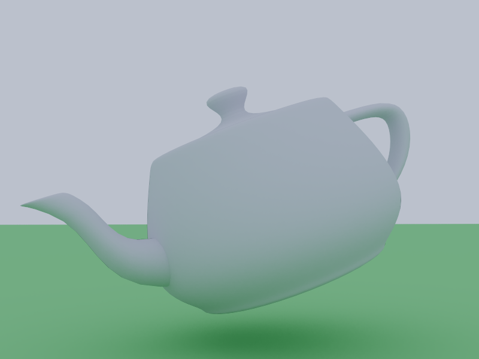
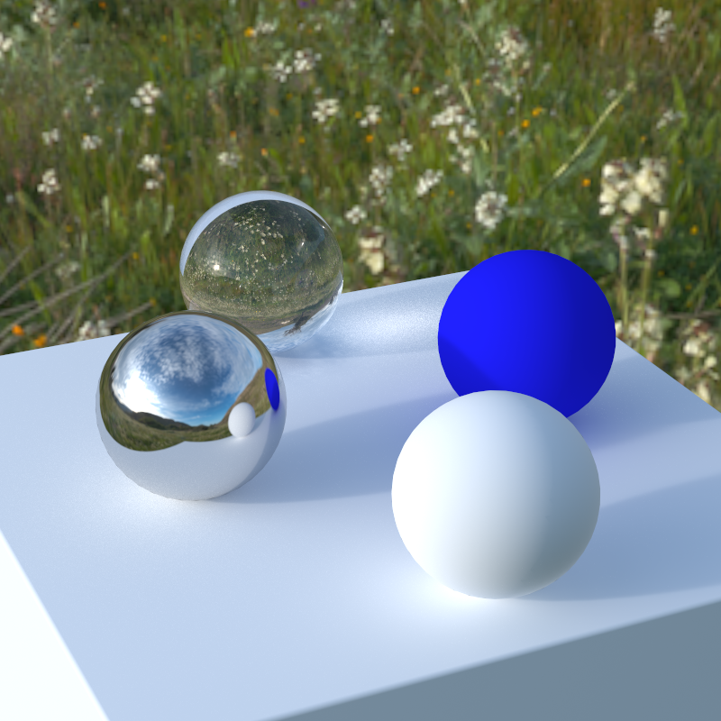
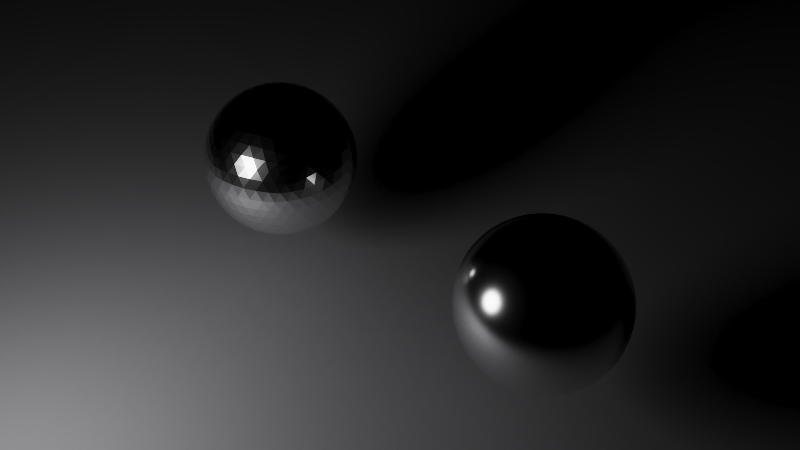
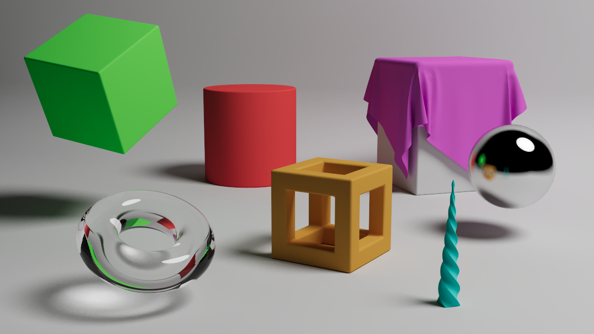

# wgsl-raytrace

A GPU path tracer in Rust, running headless on [wgpu](https://wgpu.rs/) with the
tracing kernel written in [WGSL](https://www.w3.org/TR/WGSL/). It is the GPU
counterpart to [raytrace](https://github.com/theMagicalKarp/raytrace), my CPU
tracer: same TOML scene format, same CLI, a very different back end.

## Requirements

- [mise](https://mise.jdx.dev/) — installs the pinned
  [Rust](https://www.rust-lang.org/) toolchain and runs the project tasks

```Bash
mise install     # install the pinned Rust toolchain
mise run         # test, lint and build a release binary
mise run check   # run the tests and check formatting and linting
mise run fix     # auto-apply formatter and linter suggestions
mise tasks       # list every available task
```

Running the tracer will additionally need a GPU with a working
[WebGPU](https://www.w3.org/TR/webgpu/) backend — Metal, Vulkan, DX12 or GL.

## Usage

```Bash
$ wgsl-raytrace --help
Usage: wgsl-raytrace [OPTIONS] --config <CONFIG>

Options:
  -c, --config <CONFIG>    Path of toml configuration file
  -o, --output <OUTPUT>    Path of file to save the render to [default: render.png]
  -s, --samples <SAMPLES>  Directly override the sample count listed in the configuration file
  -h, --help               Print help
  -V, --version            Print version

$ wgsl-raytrace --config examples/teapot/render.toml --output render.png
┌─── Render Settings ────────────────────────────────────────────────────────────┐
│    Dimensions: 800x600                                                         │
│  Aspect Ratio: 4:3                                                             │
│       Samples: 10000                                                           │
│   Max Bounces: 64                                                              │
│ Field of View: 45                                                              │
│     Look From: [2.5, 1.2, 3.1]                                                 │
│       Look At: [0  , 0.2, 0  ]                                                 │
│           Vup: [0  , 1  , 0  ]                                                 │
│ Defocus Angle: 0                                                               │
│Focus Distance: 1                                                               │
│   Environment: [0.7, 0.8, 0.99]                                                │
│       Objects: 2                                                               │
│             0: examples/teapot/teapot.obj [Teapot] · metal[0.42, 0.2, 0.7] rou…│
│             1: examples/teapot/teapot.obj [Plane] · lambertian[0.72, 0.72, 0.7…│
└────────────────────────────────────────────────────────────────────────────────┘
scene: 1576 triangles across 2 materials, indexed by 1511 bvh nodes 14 deep
[########################] 10000/10000 samples  41s elapsed  ~0s left
render: 800x600 written to render.png in 41.1s on Apple M4 Pro (Metal)
gpu:    3.94ms/dispatch  ·  39.4s traced  ·  min 3.71  p50 3.92  p95 4.18  max 5.30
```

The `render:` line is wall time, which includes reading the mesh, building the
hierarchy, uploading it and every stall the host takes waiting on the GPU. The
`gpu:` line is the dispatches alone, measured with timestamp queries written
either side of each compute pass, and is the number a change to the shader
should be judged by. It is absent on an adapter whose backend cannot write
timestamps, which is allowed on every one of them.

## Examples

`mise run examples` renders every scene under `examples/`, writing the image
back beside the config it came from. Those images are checked in, so what
follows is what this tracer currently produces.

### Teapot

One `.obj`, two blocks, two materials: a metal teapot standing on a lambertian
plane, with the sky background the only thing lighting it. 800x600, 1000
samples.

```Bash
wgsl-raytrace --config examples/teapot/render.toml --output examples/teapot/render.png
```



### Field

Four spheres on a plane under a photographed sky. Nothing in the scene emits,
so every photon in the frame arrives from `sky.exr` — a 4096x2048 HDRI checked
in beside the config, yawed by `rotation` to put its sun over the camera's
shoulder. Because the map is sampled directly rather than only stumbled into,
the sun casts an actual shadow instead of speckling the frame. 800x800, 50000
samples.

```Bash
wgsl-raytrace --config examples/field/render.toml --output examples/field/render.png
```



### Normals

The same sphere twice — once authored with smoothed vertex normals, once with
per-face ones — under a single emissive panel, so the only difference in the
frame is the normals the shader interpolates. 800x450, 5000 samples.



### Melee

The CPU tracer's stress scene, ported: nine blocks selected out of a single
mesh, glass and metal and lambertian side by side, lit by an emissive sphere
above the frame that is the only light in a black background. 1200x675, 10000
samples.



## Scene Configuration Specification

### Camera Configuration

The camera settings define how the scene is viewed and rendered. Below are the
parameters that control the camera's behavior:

```toml
[camera]
aspect_ratio = "standard"
image_width = 800
samples = 10000
max_bounces = 64
fov = 45
look_from = [1.55, 0.0, 1.9]
look_at = [0.0, -0.5, 0.0]
vup = [0.0, 1.0, 0.0]

defocus_angle = 0.6
focus_dist = 10.0
```

- `aspect_ratio`: Specifies the aspect ratio of the rendered image.
  - `widescreen` _(16:9)_
  - `square` _(1:1)_
  - `smartphone` _(9:16)_
  - `standard` _(4:3)_
  - `cinema` _(1.85:1)_
- `image_width`: The width of the rendered image.
- `samples`: The number of samples per pixel, controlling the quality of the
  image. Each sample is a separate GPU dispatch, so this trades render time
  against noise directly.
- `max_bounces`: Limits the number of light bounces for each ray.
- `fov`: The camera's
  [field of view](https://en.wikipedia.org/wiki/Field_of_view) in degrees.
- `look_from`: The coordinates from which the camera views the scene.
- `look_at`: The point the camera is focused on.
- `vup`: Defines the camera's orientation. _(Defaults to `[0.0, 1.0, 0.0]`,
  where y positive is "up")_
- `defocus_angle`: Variation angle of rays through each pixel _(Defaults to
  being disabled)_
- `focus_dist`: Distance from the camera `look_from` point to the plane of
  perfect focus _(Defaults to being disabled)_

### Environment

The sky, and with it the scene's ambient light. A path that escapes every object
brings home whatever is here, so a scene holding no `light` material and left at
the default black renders black.

```toml
[environment]
color = [0.70, 0.80, 0.99]
file = "sky.exr"
intensity = 1.0
rotation = 0.0
```

- `color`: The rgb value a ray finds when it misses everything. _(Defaults to
  black `[0.0, 0.0, 0.0]`)_
- `file`: An equirectangular image to read the sky out of instead, relative to
  the config location. Supersedes `color`. `.exr`, `.hdr`, `.jpg` and `.png` all
  decode; the first two carry values above one and are what an HDRI is for,
  while the last two are clamped at white by the format and light a scene
  flatly by comparison. _(Optional)_
- `intensity`: Scales whichever of the two is in play, which is where to pull a
  map's exposure down without re-authoring it. _(Defaults to `1.0`)_
- `rotation`: Degrees of yaw about the +Y axis, for turning a map so its sun
  falls where the scene wants it. _(Defaults to `0.0`)_

The whole table is optional. A scene that omits it gets a black sky, which is
what omitting the old `camera.background` did — that key moved here and is now
`environment.color`.

A flat `color` is uploaded as a one-texel map, so it is the same lookup the
shader does for an image and not a second path through it.

The map is sampled directly as well as found by escaping rays. Loading one
builds a distribution over its texels — brightness weighted by the sky each
texel covers — and every diffuse bounce aims a shadow ray into it in proportion
to that, the same next event estimation a `light` material gets. Multiple
importance sampling combines the two, so a small bright sun casts a shadow
instead of speckling the frame: 2.9x less error at 200 samples on the field
scene under the `.exr`, and 5.2x on a scene whose sun is sharper, for about 1.5x
the time per sample.

A flat `color` deliberately gets none of that. Cosine-weighted scattering
already samples a uniform sky perfectly, so a second strategy there could only
add a shadow ray per bounce and take nothing off the noise.

### Objects

A scene is a list of objects, each one a combination of "geometry" and
"material".

### Geometry

#### Wavefront _(.obj file)_

Wavefront meshes are the **only** geometry this tracer supports. Triangles are
the single primitive the shader intersects, so anything that would be a sphere
or a quad in the CPU tracer is authored as a mesh here instead.

```toml
[[objects]]
shape = "wavefront"
file = "teapot.obj"
group = "Teapot"
```

- `file`: Path to the `.obj` file _(relative to the config location)_
- `group`: Optional name of a single `o`/`g` block to load from the file. When
  omitted the whole file is used. This is how one `.obj` gets several materials
  — list it once per block, as `examples/teapot` does. A name that does not
  match lists the ones the file does have. _(A block whose name contains a space
  cannot be selected — the `.obj` grammar allows one word after a `g`.)_

Faces with more than three corners are fanned into triangles, and a corner with
no normal of its own gets the face's geometric one, so every triangle reaching
the shader is smooth-shaded the same way.

### Transforms

Each object may carry an ordered list of transforms, applied first to last and
baked into the mesh before it reaches the GPU, so the tracer works entirely in
world space. Normals are carried by the inverse transpose of that transform, so
a non-uniform `scale` tilts the surface the way it actually should.

```toml
[[objects.transform]]
type = "scale"
scalar = [0.5, 0.5, 0.5]

[[objects.transform]]
type = "rotate"
axis = "y"
degrees = 31.5

[[objects.transform]]
type = "translate"
offset = [0.0, 1.0, 0.0]
```

- `scale`: `scalar` — per-axis scale factors.
- `rotate`: `axis` (`x`, `y` or `z`) and `degrees`.
- `translate`: `offset` — the vector to move by.

### Materials

Materials define the visual properties of the objects. The set is smaller than
the CPU tracer's: the shader carries one scalar per material, so the
texture-backed materials (checkered, image, noise) are absent until there is
somewhere to put them.

#### Lambertian

```toml
[[objects]]
material = "lambertian"
albedo = [1.0, 0.2, 0.3] # red
```

- `albedo`: The diffuse reflection color as an RGB array.

#### Metal

```toml
[[objects]]
material = "metal"
albedo = [0.7, 0.7, 0.7]
roughness = 0.13
```

- `albedo`: The reflective color of the metal.
- `roughness`: Controls the scattering of reflected light. _(The higher, the
  more scattering)_

#### Dielectric

```toml
[[objects]]
material = "dielectric"
refraction_index = 1.5
```

- `refraction_index`: The index of refraction for the material.

#### Glass

```toml
[[objects]]
material = "glass"
```

_This is a dielectric with an index of refraction of `1.5`_

#### Water

```toml
[[objects]]
material = "water"
```

_This is a dielectric with an index of refraction of `1.33`_

#### Light

```toml
[[objects]]
material = "light"
emit = [7.0, 7.0, 7.0]
```

- `emit`: The RGB color of the emitted light.

Emission is one-sided: a surface gives off light through the face its winding
points at and nothing through the other, so a ceiling panel wound to face down
lights the room and not the cavity above it. A closed mesh is unaffected — its
inside is never seen — but open geometry has to be wound to face where the light
is wanted.

## Layout

```
src/
  main.rs            CLI entry point: read scene, validate, load, render, save
  config/mod.rs      the TOML scene format and its CLI arguments
  scene/mod.rs       meshes and materials, flattened into GPU buffers
  scene/bvh.rs       the bounding volume hierarchy built over those triangles
  render/mod.rs      the wgpu pass: buffers in, pixels out, PNG on disk
  render/timing.rs   timestamp queries, and what they average to
  render/golden.rs   the rendered frame, diffed against a checked-in one
  render/shader.wgsl the WGSL kernel — the path tracer itself
  math/mod.rs        just enough linear algebra to bake a model transform
examples/
  teapot/            a two-object scene, mesh included
  normals/           smoothed against per-face normals, side by side
  melee/             the many-material stress scene, and its light
tests/
  golden/            the scene behind the golden-image test, and its reference
```

`config` is deliberately pure data — deserializing a scene touches nothing but
the config file, and `Config::validate` is the separate pass that resolves
object paths against the config's directory. Keeping those apart is what lets
the whole scene format be tested without a GPU, or a mesh, in sight.

`scene` is the one place that knows what a `.obj` file is. `Scene::load` takes a
config and returns flat arrays — `GpuTriangle`, `GpuMaterial` and `GpuBvhNode`,
all `#[repr(C)]` and laid out to match their WGSL counterparts — with the
polygon fanning, missing normals, block selection and model transforms already
resolved. A triangle names its material by index into the material array, which
is one entry per object in config order.

The hierarchy is what makes a scene of any size tractable: a linear scan pays
for every triangle in the scene on every bounce, while a tree of nested boxes
lets a ray reject whole subtrees with one slab test. It is built with a binned
surface area heuristic — the alternatives do badly on exactly this shape of
scene, where two enormous floor triangles sit alongside a thousand small ones —
and the triangles are permuted into leaf order on the way out, so a leaf can
name its own with an offset and a count. The builder caps the tree's depth below
the shader's fixed traversal stack, which is what makes that stack a bound
rather than a hope.

`render` owns the GPU and nothing else. It uploads those arrays plus a
`GpuCamera` uniform, runs the dispatch loop, and averages the accumulated
radiance into 8-bit sRGB. The bind group layouts are reflected out of the shader
rather than declared twice, so a binding that changes in WGSL fails at pipeline
creation instead of quietly reading the wrong bytes — and because the four
structs are the contract between the two languages, a test parses the shader
with naga and checks their sizes against the Rust ones. That runs without a GPU,
so CI catches a layout drift that only a render would otherwise reveal.

The same trick covers the traversal: `scene/bvh.rs` carries a Rust
reimplementation of the shader's walk, structurally line-for-line with the WGSL,
and tests it against a brute-force scan over thousands of rays — including the
axis-aligned ones that make an inverse direction infinite. A tree the shader
would traverse wrongly fails on CPU first.

Both of those check the seams rather than the picture, and a shader that
compiles, traverses correctly and shades wrongly passes them. `render/golden.rs`
closes that: it renders `tests/golden/render.toml` — the teapot at 32x32 — and
diffs it against `tests/golden/reference.png`. The comparison carries a
tolerance because the reference is generated on one backend and checked on
another, and the constants behind it are documented where they are declared,
with the measurements they came from. Regenerate the reference with
`UPDATE_GOLDEN=1 cargo test golden` whenever the render is meant to change; a
machine with no working adapter can opt out with
`WGSL_RAYTRACE_SKIP_GPU_TESTS=1`, which is deliberately opt-in rather than a
silent skip.
