# wgsl-raytrace

A GPU path tracer in Rust. It runs headless on [wgpu](https://wgpu.rs/), and the
tracing kernel is written in [WGSL](https://www.w3.org/TR/WGSL/). It is the GPU
counterpart to [raytrace](https://github.com/theMagicalKarp/raytrace) and reads
the same TOML scene format.

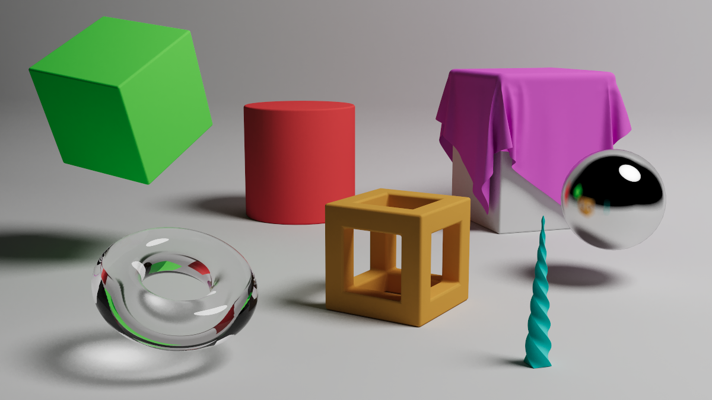

## Quick start

You need [mise](https://mise.jdx.dev/) and a GPU with a working
[WebGPU](https://www.w3.org/TR/webgpu/) backend (Metal, Vulkan, DX12 or GL).

```Bash
mise install                 # install the pinned Rust toolchain
mise run release             # build target/release/wgsl-raytrace
target/release/wgsl-raytrace --config examples/teapot/render.toml --denoise --preview
```

`--preview` draws the image in your terminal as it renders, and `--denoise`
cleans up the leftover noise. The result is written to `render.png`.

To make your own scene, copy one of the [examples](#examples) and edit its
`render.toml`. For everything else, see the docs:

- [CLI reference](docs/cli.md): every flag, and what the console output means.
- [Config reference](docs/config.md): the scene file: camera, sky, objects and
  materials.
- [Expression reference](docs/expressions.md): patterns and image textures for
  material inputs.
- [Rendering pipeline](docs/rendering.md): how a frame is traced, and how the
  denoiser works and is tuned.

## Examples

Each directory under `examples/` holds a `render.toml` and its checked-in
`render.png`.

```Bash
mise run examples            # render every example with --preview --denoise
mise run example melee       # render one
mise run example melee --debug   # also write raw frame + AOVs to examples/melee/debug
```

|                                                                                                                                                                                                                                                                        |                                                                                                                                                                                          |
| ---------------------------------------------------------------------------------------------------------------------------------------------------------------------------------------------------------------------------------------------------------------------- | ---------------------------------------------------------------------------------------------------------------------------------------------------------------------------------------- |
| 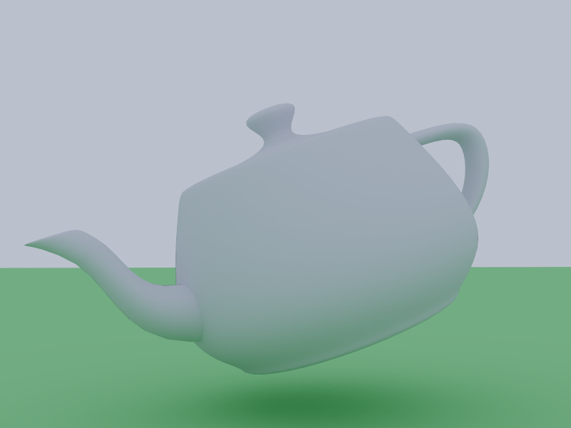 `teapot`: lit only by a flat sky                                                                                                                                                                                                 | 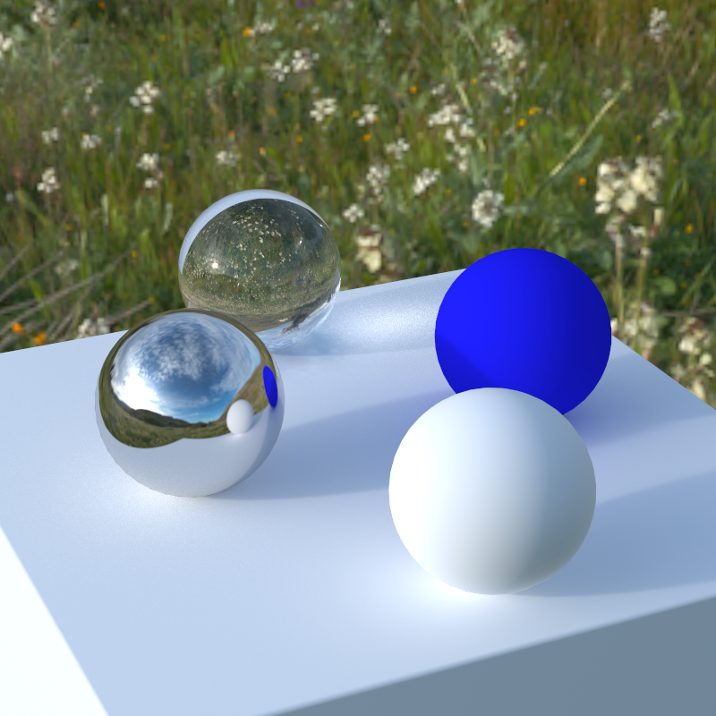 `field`: lit only by an HDRI with an importance-sampled sun                                                                                          |
| 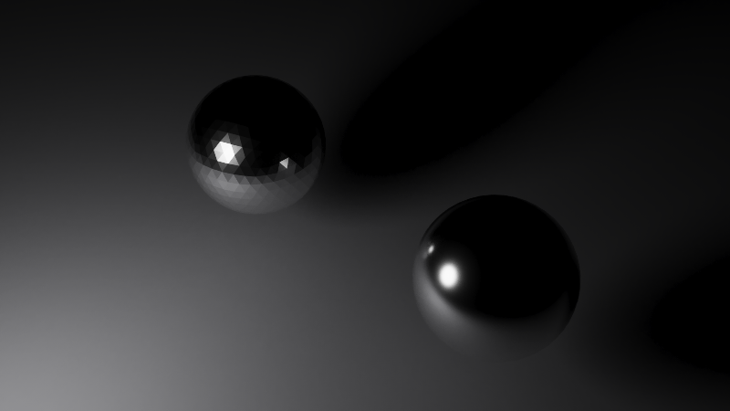 `normals`: smooth vs. per-face normals                                                                                                                                                                                         |  `melee`: mixed materials, one emitter                                                                                                                |
| 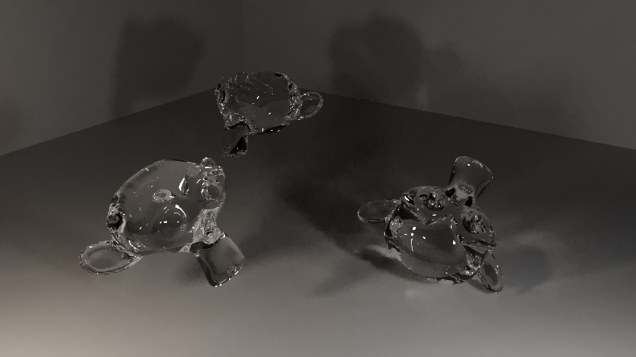 `glass`: glass monkeys, two lights; the scene with the most fireflies                                                                                                                                                              | 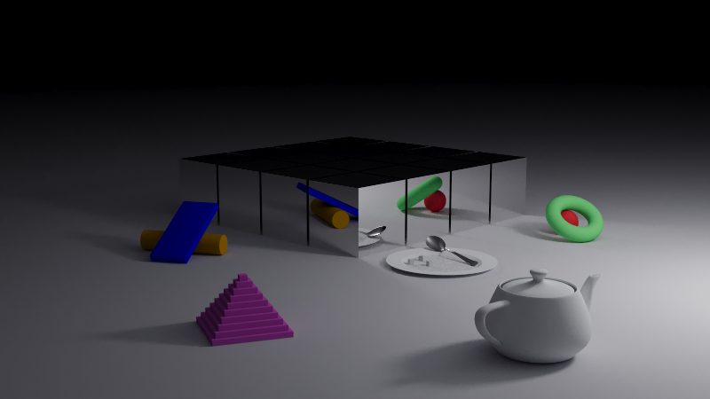 `cubes`: a room of objects lit by one emitter                                                                                                        |
| 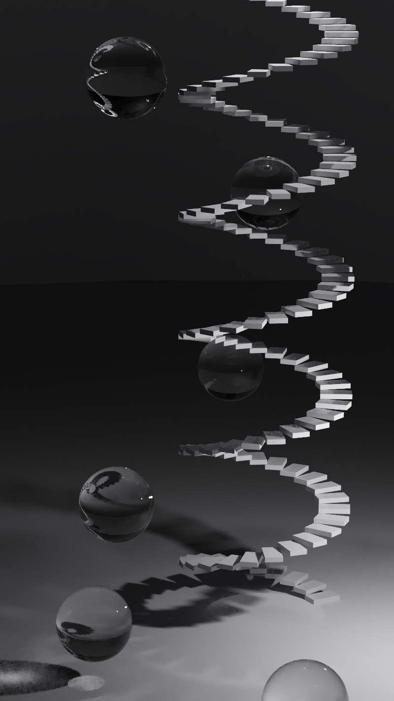 `stairs`: glass orbs and a staircase, two lights                                                                                                                                                                                 | 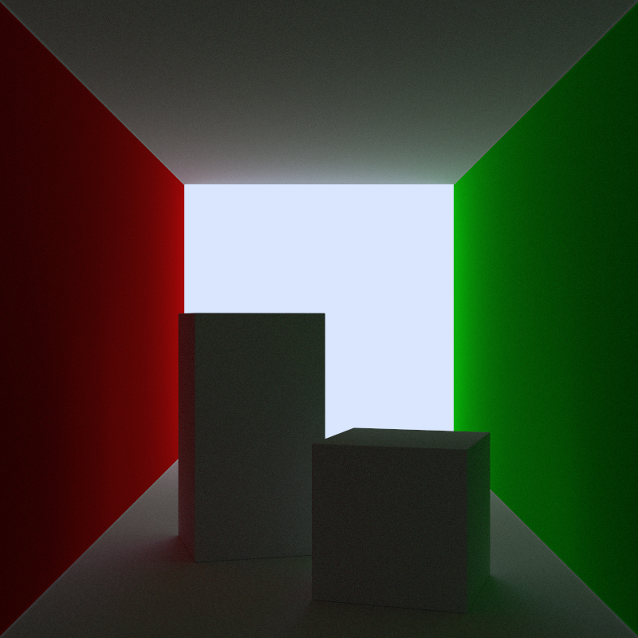 `tunnel`: coloured walls under an HDRI                                                                                                             |
| 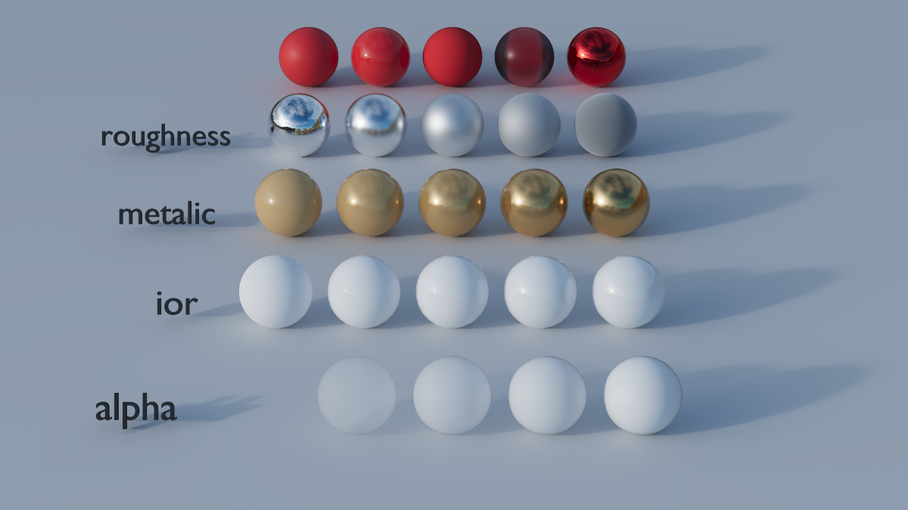 `principled`: one row per parameter, back to front: emission, base color, roughness, metallic, IOR, alpha                                                                                                                | 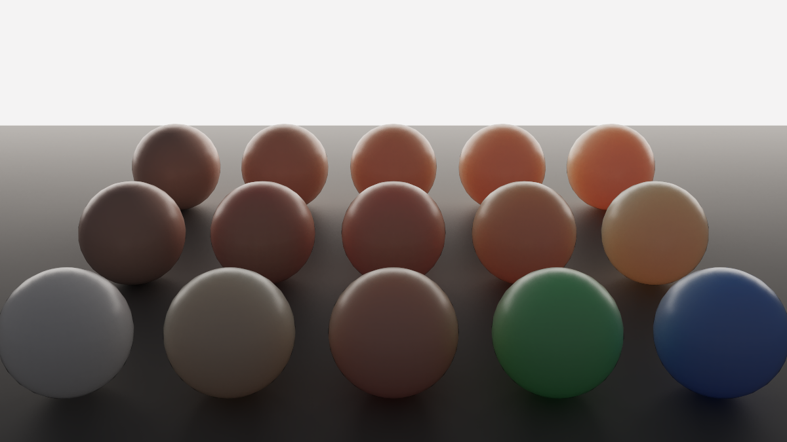 `subsurface`: backlit spheres, one row each for weight, scale and radius                                                                   |
| 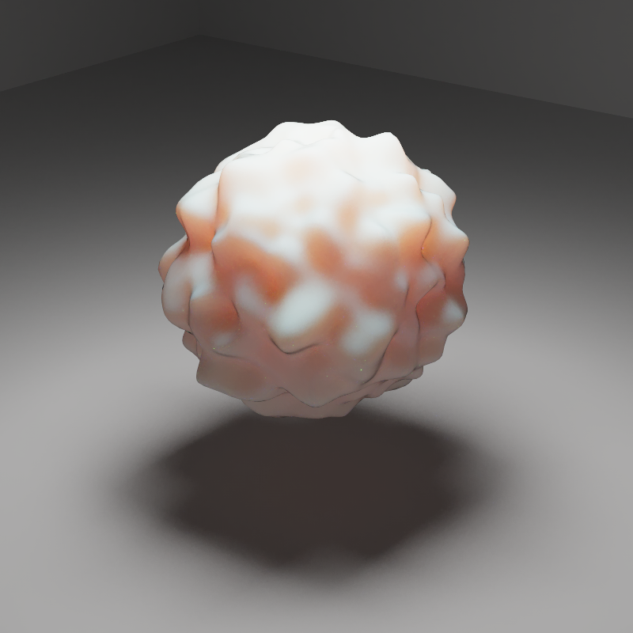 `blob`: a waxy subsurface blob in a grey room, lit by one overhead emitter                                                                                                                                                           | 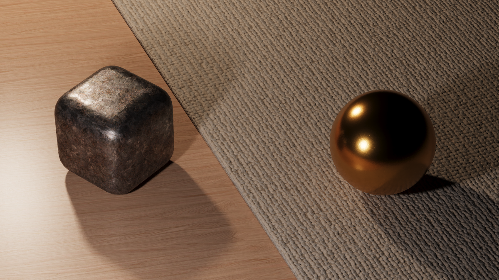 `textures`: oak floor, fabric rug, metal cube and gold ball, each with colour, roughness, metallic and normal maps, under two blackbody lights |
| 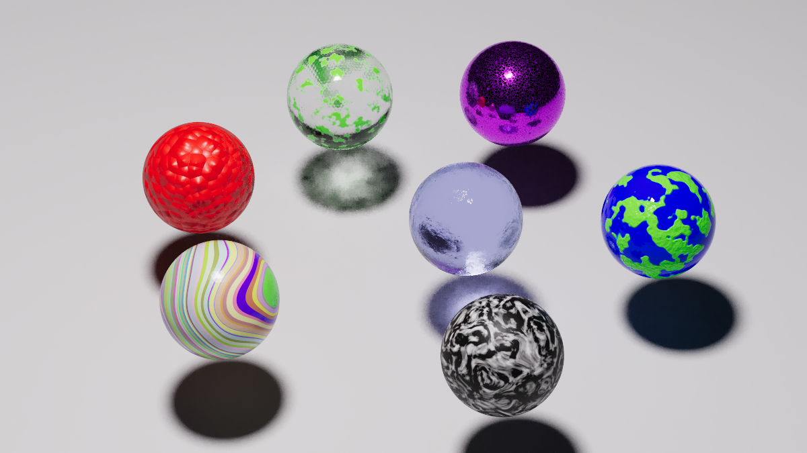 `noise`: seven balls on a pool of water, each a Blender node tree written as expressions: noise and Voronoi through ramps, a Voronoi read at a noise, bumped cells, cell edges as roughness, and named masks shared between fields |                                                                                                                                                                                          |

## Development

| Task             | Description                                              |
| ---------------- | -------------------------------------------------------- |
| `mise run`       | Tests, lints, and a release build                        |
| `mise run check` | Tests, plus `cargo fmt --check` and `clippy -D warnings` |
| `mise run fix`   | Apply formatter and clippy fixes                         |
| `mise run test`  | `cargo test --all-features`                              |

Most tests run without a GPU:

- WGSL struct sizes are checked against their Rust `#[repr(C)]` counterparts
  using naga.
- A Rust port of the shader's BVH traversal is tested against brute-force
  intersection.

`render/golden.rs` renders the small scenes in `tests/golden/` and diffs each
one against its reference PNG. Regenerate them with
`UPDATE_GOLDEN=1 cargo test golden`. On a machine with no GPU adapter, set
`WGSL_RAYTRACE_SKIP_GPU_TESTS=1`.

### Source layout

```
src/
  main.rs              CLI: parse, validate, load, render, write outputs
  config/mod.rs        TOML schema and CLI args (pure data, no GPU)
  config/input.rs      material input trees (patterns), as pure data
  config/expression.rs parser for pattern expressions → input trees
  scene/               .obj loading, transforms, materials, BVH, light table, sky CDF
  scene/program.rs     input trees → the flat program the shader evaluates
  scene/noise.rs       the shader's noise, voronoi and ramp again in Rust, for the tests
  scene/texture.rs     image loading, dedupe and resizing into texture arrays
  math/mod.rs          matrices for model transforms
  render/
    mod.rs             device setup, sample loop, readback, resolve
    shader.wgsl        the path tracer
    camera.rs          GpuCamera uniform
    denoise.rs/.wgsl   à-trous filter
    aov.rs             feature buffers → normal/albedo/depth PNGs
    variance.rs        moments → noise statistics and heatmap
    tonemap.rs         ACES curve in ACEScg
    preview.rs         terminal preview (kitty.rs draws it)
    progress.rs        console progress bar
    timing.rs          GPU timestamp queries
    golden.rs          golden-image test
    shader_tests.rs    unit tests for shader.wgsl functions, run on the GPU
```
