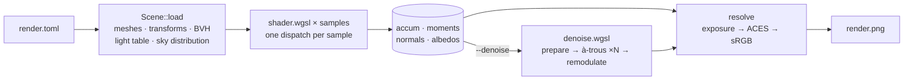

# Rendering pipeline



1. **Load.** The host parses and validates the config, loads each mesh, applies
   its transforms, and builds a binned-SAH BVH (depth-capped to fit the shader's
   fixed traversal stack). It also builds a power-weighted table of emissive
   triangles and, when an HDRI is present, a marginal/conditional CDF over its
   texels. All of this is uploaded once as storage buffers, beside the image
   maps' two texture arrays.
2. **Trace.** One compute dispatch per sample, with one thread per pixel
   (`shader.wgsl`). Each thread:
   - Casts a stratified, jittered primary ray. With a lens, the ray starts on
     the lens disk.
   - Walks the BVH to find the nearest hit and resolves its material: a surface
     with patterned fields has each one evaluated at that hit, and everything
     downstream sees a plain material either way.
   - Adds the surface's emission if the front face was hit (weighed by MIS
     against the emitter sample from the previous bounce). A surface that
     scatters nothing, like a `light`, ends the path there.
   - At surfaces with a non-mirror lobe (diffuse, or rough microfacet), sends
     shadow rays to one sampled emitter and one sampled sky direction (next
     event estimation). These are combined with the BSDF sample using the power
     heuristic (MIS), so no light is counted twice.
   - Samples the BSDF: picks one lobe (metal, specular, glass, diffuse or
     subsurface), draws a direction from it (GGX visible normals for the
     microfacet lobes), and weighs it against every lobe's density. Applies
     Russian roulette from bounce 4 on.
   - On the subsurface lobe the direction points _into_ the surface: the path
     walks the medium until it reaches the boundary again, and the exit point —
     a white Lambertian facing out — becomes the vertex that sends the shadow
     rays and chooses the next direction. The entry sends none: what it would
     reflect depends on where the walk comes out.
   - Drops non-finite samples, and applies outlier rejection if `k > 0`.
3. **Accumulate.** Each sample adds to four per-pixel buffers:
   - `accum`: radiance sum and sample count.
   - `moments`: sum of luminance and of luminance², used to recover per-pixel
     variance. Kept twice: once over every sample as drawn (for outlier
     rejection) and once over what `accum` kept (for the denoiser and the
     `noise:` figures).
   - `normals` and `albedos`: feature sums for the denoiser (normal, depth,
     albedo), plus a majority vote for the object id.

   Because everything is stored as a sum, `sum / n` is a finished frame at any
   point. That is how `--preview` works without a separate code path.
4. **Denoise** (optional). See [Denoising](#denoising).
5. **Resolve** (`render/tonemap.rs`). The pixel is averaged, multiplied by
   `exposure`, tone mapped with an ACES fit in ACEScg primaries, and
   gamma-encoded to 8-bit sRGB. The filmic curve compresses highlights instead
   of clipping them. Applying it in ACEScg stops saturated highlights from
   shifting hue. This is the only non-linear step; everything before it works in
   linear radiance.

## Denoising

`--denoise` runs an edge-avoiding à-trous wavelet filter: the spatial half of
[SVGF](https://research.nvidia.com/publication/2017-07_spatiotemporal-variance-guided-filtering-real-time-reconstruction-path-traced).
It runs once, after the last sample, on the GPU (`render/denoise.wgsl`). It only
reads the tracer's buffers and never writes to them, so the unfiltered frame is
still available through `--debug`. On `examples/melee` it takes 500 samples from
4.02 to 1.24 mean error against a 10 000-sample reference, and adds about 10 ms.

### Feature buffers

As each path is traced, the shader records features of the **first opaque
surface** it reaches (diffuse, subsurface or emissive). It records the first hit
instead only when a path never reaches an opaque surface. Glass and metal are
passed through, so a floor seen through a glass torus keeps its own edges
instead of taking on the torus's silhouette. The features are:

| Feature   | Use                                                                                                                                             |
| --------- | ----------------------------------------------------------------------------------------------------------------------------------------------- |
| normal    | Tells apart surfaces facing different directions. Zero normal means a miss, and those pixels are not filtered.                                  |
| depth     | Distance along the whole path, so it stays continuous through refraction.                                                                       |
| albedo    | Surface colour, divided out before filtering and multiplied back after.                                                                         |
| object id | Pixels are only blended with others from the same object. Voted rather than averaged, so an edge pixel gets the object most of its samples saw. |

These features barely change from sample to sample, so they are almost free of
noise. That makes them reliable for deciding which neighbouring pixels show the
same surface.

### Passes

All three passes share one entry point and ping-pong between two scratch
buffers.

1. **Prepare.**
   - Demodulate: `irradiance = radiance / max(albedo, 0.01)`. Texture and colour
     detail stays in the noise-free albedo, so the filter only smooths lighting.
   - Estimate the variance of each pixel's _mean_ from the moments:
     `(E[x²] − E[x]²) / n`, divided by the albedo luminance squared to match the
     demodulated signal.
   - Blur that variance with a 3×3 binomial kernel. Without this, pixels with a
     variance of exactly zero would reject every neighbour and stay as isolated
     speckles.
2. **Filter** × `iterations`. Each pass is a 5×5 B3-spline kernel
   (`1/16, 1/4, 3/8, 1/4, 1/16`) with taps `2^i` pixels apart. Strides of 1, 2,
   4, 8 and 16 reach a footprint 125 pixels across for 125 taps per pixel. Each
   tap `q` around pixel `p` is weighted by:

   ```
   w = kernel
     · max(0, n_p · n_q) ^ sigma_normal                               normal
     · exp(−|d_p − d_q| / (sigma_depth · |∇d · offset|))              depth
     · exp(−|l_p − l_q| / (sigma_luminance · √var_p))                 luminance
     · [id_p == id_q]                                                 object
   ```

   The luminance term does the actual smoothing. It blends away differences that
   the pixel's own noise can explain and keeps differences it can't. The other
   terms decide _where_ smoothing is allowed. Variance is carried forward with
   squared weights (`Σw²·var / (Σw)²`), so each wider pass knows how much noise
   the previous one left. Taps outside the frame are dropped and the remaining
   weights renormalised.
3. **Remodulate.** Multiply by the same clamped albedo. The result then goes
   through the same resolve step as an unfiltered frame. With `iterations = 0`,
   the output matches the input to within one 8-bit step, and the test suite
   checks this.

### Tuning

Render with `--denoise --debug <dir>` and compare `render.png` with
`<dir>/raw.png`.

| Symptom                                  | Adjust                                                  |
| ---------------------------------------- | ------------------------------------------------------- |
| Lighting detail or soft shadows smeared  | Lower `sigma_luminance`                                 |
| Noise left everywhere                    | Raise `sigma_luminance` or `iterations`, or add samples |
| Noise left on curved surfaces            | Lower `sigma_normal`                                    |
| Light bleeding across creases            | Raise `sigma_normal`                                    |
| Noise left on sloped or distant surfaces | Raise `sigma_depth`                                     |
